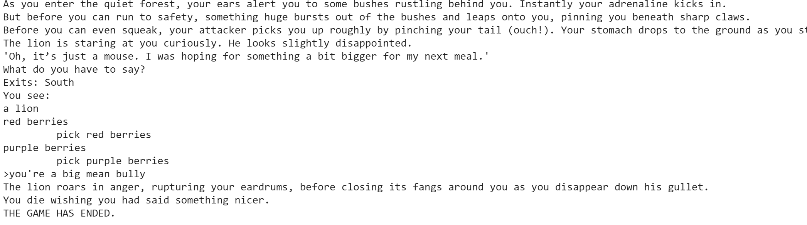

# CIS700
HW1:
This game is our unique take on the classic Aesop Fable of The Lion & The Mouse. You play as the mouse and your goal is to not only survive the encounter with the lion but to save him in the end, after solving a puzzle. We decided to pick that topic because it was a simple enough story that we knew we could finish it in a week but also elaborate on it as much as we wanted because it was open to interpretation/changes.

HW2:
To implement WordNet, we took the generated list of commands that mapped to the closest original command and saved it in a txt file. We created a list of tuples in our code from that txt file. From then on, if a player typed in a command that wasn't an original command word for word, we first looked through the WordNet list to see if it matched any. If so, we ran the original command that their command was paired with in the tuple. If not, then we used word embeddings to find the closest command (if any) by constructing a sentence embedding for the input command and checking its distance with all of our existing commands (the sentence embeddings are computed using vectors from Magnitude). We also implemented sentiment analysis using TextBlob in our game. We required its usage in one of the core puzzles of our game, which is responding to the lion (a wrong choice of words means death!). We also utilized it for some side characters in the game, such as talking to the zebras or giraffe. We implemented it by reading in a typed command and using TextBlob to return its polarity. If it was a positive value, then that means the user complimented or said something nice. If it was negative, then the user said something offensive or negative. If it was zero, then the sentence was neutral. Below are some interactions from our game:

